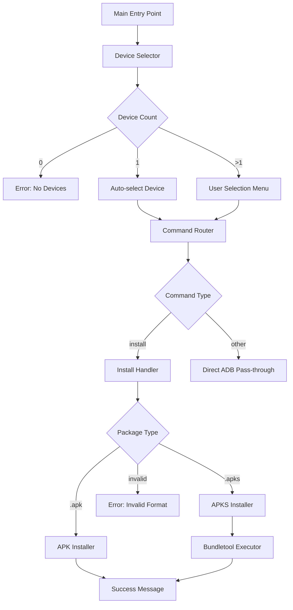

# Design Document: ADB Wrapper System

## Overview

The ADB Wrapper System is a batch script-based automation tool that simplifies Android application deployment workflows. The system intelligently handles device selection, package format detection (APK vs APKS), and automated bundletool integration for APKS file installations.

The design follows a modular subroutine architecture where each major capability is encapsulated in a labeled section that can be called via `call :label_name`. This approach maintains consistency with the existing codebase patterns observed in `selector.bat` and `adb2.bat`.

### Key Design Principles

1. **Single Entry Point**: One main script (`adb-wrapper.bat`) serves as the orchestrator
2. **Subroutine Modularity**: Each functional component is implemented as a callable label
3. **State Management**: Device ID is stored in environment variables for cross-subroutine access
4. **Error-First Design**: All operations check for errors before proceeding
5. **User Experience**: Clear console output with blank lines for readability

## Architecture

### High-Level Component Diagram



### Script Structure

The main script will be organized into the following sections:

1. **Initialization** - Script setup and variable declarations
2. **Main Entry** - Command-line argument parsing and routing
3. **Device Selector** - Device enumeration and selection logic
4. **Install Handler** - Package type detection and routing
5. **APK Installer** - Standard ADB install execution
6. **APKS Installer** - Bundletool integration and execution
7. **Utility Subroutines** - Helper functions (error display, choice reset, etc.)

## Components and Interfaces

### 1. Main Entry Point

**Purpose**: Parse command-line arguments and route to appropriate handler

**Interface**:
- Input: Command-line arguments (`%*`)
- Output: Routes to device selector or displays usage help
- Variables Set: `%command%`, `%package_file%`

**Logic Flow**:
```batch
@echo off
setlocal enabledelayedexpansion

:: Parse arguments
set "command=%1"
set "package_file=%2"

:: Route based on command
if "%command%"=="install" (
    call :device_selector
    if errorlevel 1 exit /b 1
    call :install_handler "%package_file%"
) else if "%command%"=="" (
    call :show_usage
) else (
    call :device_selector
    if errorlevel 1 exit /b 1
    call :adb_passthrough %*
)

exit /b 0
```

### 2. Device Selector Component

**Purpose**: Enumerate connected devices and select target device

**Interface**:
- Input: None (queries ADB)
- Output: Sets `%selected_device%` environment variable
- Return Code: 0 on success, 1 on error

**Implementation Pattern** (based on `adb2.bat`):

```batch
:device_selector
setlocal enabledelayedexpansion
set "i=0"
set "device_count=0"

:: Enumerate devices
for /f "eol=L tokens=1" %%a in ('adb devices ^| findstr "device"') do (
    set /a "i+=1"
    set "device_!i!=%%a"
    set /a "device_count+=1"
)

:: Handle device count scenarios
if "!device_count!"=="0" (
    echo.
    echo ERROR: No devices connected
    echo.
    exit /b 1
)

if "!device_count!"=="1" (
    endlocal & set "selected_device=%device_1%"
    exit /b 0
)

:: Multiple devices - show selection menu
echo.
echo Multiple devices detected:
echo.
set "choicelist="
for /l %%c in (1, 1, !device_count!) do (
    echo %%c. !device_%%c!
    set "choicelist=!choicelist!%%c"
)

call :reset_choice
choice /c %choicelist% /n /m "Select device: "
set "selection=%errorlevel%"

for %%d in (!device_%selection%!) do (
    endlocal & set "selected_device=%%d"
)

exit /b 0
```

**Key Design Decisions**:
- Uses dynamic variable naming (`device_1`, `device_2`, etc.) consistent with existing code
- Leverages `choice` command for user selection
- Uses `endlocal & set` pattern to persist variable across scope boundary

### 3. Install Handler Component

**Purpose**: Detect package type and route to appropriate installer

**Interface**:
- Input: `%1` - Package file path
- Output: Routes to APK or APKS installer
- Return Code: 0 on success, 1 on error

**Implementation**:

```batch
:install_handler
set "package=%~1"

:: Validate package exists
if not exist "%package%" (
    echo.
    echo ERROR: Package file not found: %package%
    echo.
    exit /b 1
)

:: Extract extension
set "ext=%~x1"

:: Route based on extension
if /i "%ext%"==".apk" (
    call :install_apk "%package%"
    exit /b %errorlevel%
)

if /i "%ext%"==".apks" (
    call :install_apks "%package%"
    exit /b %errorlevel%
)

:: Invalid extension
echo.
echo ERROR: Invalid package format: %ext%
echo Supported formats: .apk, .apks
echo.
exit /b 1
```

**Key Design Decisions**:
- Uses `%~x1` to extract file extension
- Case-insensitive comparison with `/i` flag
- Validates file existence before processing

### 4. APK Installer Component

**Purpose**: Install APK files using standard ADB install command

**Interface**:
- Input: `%1` - APK file path
- Output: Console output from ADB install
- Return Code: 0 on success, 1 on error

**Implementation**:

```batch
:install_apk
set "apk_file=%~1"

echo.
echo Installing APK to device %selected_device%...
echo.

adb -s %selected_device% install -r "%apk_file%"

if errorlevel 1 (
    echo.
    echo ERROR: APK installation failed on device %selected_device%
    echo.
    exit /b 1
)

echo.
echo SUCCESS: APK installed successfully on device %selected_device%
echo.

exit /b 0
```

**Key Design Decisions**:
- Uses `-r` flag to replace existing application
- Checks errorlevel for installation failure
- Includes device ID in error messages for clarity

### 5. APKS Installer Component

**Purpose**: Install APKS files using bundletool

**Interface**:
- Input: `%1` - APKS file path
- Output: Console output from bundletool installation
- Return Code: 0 on success, 1 on error

**Implementation**:

```batch
:install_apks
set "apks_file=%~1"

echo.
echo Installing APKS to device %selected_device%...
echo.

:: Install using bundletool
java -jar bundletool-all-1.18.3_2.jar install-apks ^
    --apks="%apks_file%" ^
    --device-id=%selected_device%

if errorlevel 1 (
    echo.
    echo ERROR: APKS installation failed on device %selected_device%
    echo.
    exit /b 1
)

echo.
echo SUCCESS: APKS installed successfully on device %selected_device%
echo.

exit /b 0
```

**Key Design Decisions**:
- Uses bundletool's `install-apks` command directly
- No need for build-apks step (APKS already contains APK set)
- No locale detection needed (bundletool handles device matching automatically)
- Simpler than AAB installation (fewer steps, no temporary files)
- Passes device ID to ensure installation to correct device

### 6. Utility Subroutines

**Purpose**: Provide helper functions used across components

**reset_choice**:
```batch
:reset_choice
:: Resets errorlevel to 0 for choice command
exit /b 0
```

**show_usage**:
```batch
:show_usage
echo.
echo ADB Wrapper System
echo.
echo Usage:
echo   adb-wrapper.bat install ^<package-file^>
echo   adb-wrapper.bat ^<adb-command^> [arguments]
echo.
echo Examples:
echo   adb-wrapper.bat install myapp.apk
echo   adb-wrapper.bat install myapp.apks
echo   adb-wrapper.bat shell pm list packages
echo   adb-wrapper.bat logcat
echo.
exit /b 0
```

**adb_passthrough**:
```batch
:adb_passthrough
:: Pass any non-install command directly to ADB with selected device
adb -s %selected_device% %*
exit /b %errorlevel%
```

## Data Models

### Environment Variables

The system uses environment variables for state management across subroutines:

| Variable | Type | Scope | Description |
|----------|------|-------|-------------|
| `selected_device` | String | Global | ADB device ID of selected device |
| `package_file` | String | Local | Path to package file being installed |
| `command` | String | Local | Command passed to wrapper |
| `device_count` | Integer | Local | Number of connected devices |
| `device_N` | String | Local | Dynamic variables for device list (N=1,2,3...) |
| `choicelist` | String | Local | Concatenated list of choice options |

### File Dependencies

| File | Purpose | Required |
|------|---------|----------|
| `bundletool-all-1.18.3_2.jar` | APKS installation | Yes (for APKS) |

## Error Handling

### Error Categories and Responses

1. **No Devices Connected**
   - Detection: `device_count == 0`
   - Response: Display error message and exit with code 1
   - Message: "ERROR: No devices connected"

2. **Package File Not Found**
   - Detection: `not exist "%package%"`
   - Response: Display error with file path and exit with code 1
   - Message: "ERROR: Package file not found: {path}"

3. **Invalid Package Format**
   - Detection: Extension not `.apk` or `.apks`
   - Response: Display error with supported formats and exit with code 1
   - Message: "ERROR: Invalid package format: {ext}"

4. **Bundletool Execution Failure**
   - Detection: `errorlevel 1` after bundletool command
   - Response: Display bundletool error output and exit with code 1
   - Message: "ERROR: APKS installation failed on device {device_id}"

5. **Installation Failure**
   - Detection: `errorlevel 1` after install command
   - Response: Display error with device ID and exit with code 1
   - Messages:
     - "ERROR: APK installation failed on device {device_id}"
     - "ERROR: APKS installation failed on device {device_id}"

### Error Handling Pattern

All subroutines follow this pattern:

```batch
:subroutine_name
:: Perform operation
command_that_might_fail

:: Check for error
if errorlevel 1 (
    echo.
    echo ERROR: Descriptive error message
    echo.
    exit /b 1
)

:: Continue on success
exit /b 0
```

### Cleanup on Error

The AAB installer performs cleanup even on error:

```batch
if errorlevel 1 (
    echo ERROR: Installation failed
    del temp_apks.apks 2>nul
    exit /b 1
)
```

## Testing Strategy

### Unit Testing Approach

Since batch scripts don't have traditional unit testing frameworks, testing will be performed through:

1. **Manual Test Cases**: Execute specific scenarios and verify output
2. **Test Scripts**: Create separate batch files that call subroutines with known inputs
3. **Integration Testing**: Test complete workflows end-to-end

### Test Scenarios

#### Device Selection Tests

| Scenario | Setup | Expected Result |
|----------|-------|-----------------|
| No devices | Disconnect all devices | Error message displayed |
| Single device | Connect one device | Auto-selected without prompt |
| Multiple devices | Connect 2+ devices | Selection menu displayed |
| Invalid selection | Multiple devices, invalid choice | Re-prompt or error |

#### Package Type Detection Tests

| Scenario | Input | Expected Result |
|----------|-------|-----------------|
| Valid APK | `test.apk` | Routes to APK installer |
| Valid APKS | `test.apks` | Routes to APKS installer |
| Invalid extension | `test.zip` | Error message |
| Missing file | `nonexistent.apk` | File not found error |
| Case insensitive | `TEST.APK` | Routes to APK installer |

#### Locale Detection Tests

| Scenario | Device Config | Expected Result |
|----------|---------------|-----------------|
| English device | DPI=480, Lang=en | DPI=480, Languages=en |
| Spanish device | DPI=320, Lang=es | DPI=320, Languages=en,es |
| Missing DPI | DPI query fails | Error message |
| Missing language | Lang query fails | Error message |

#### Installation Tests

| Scenario | Package Type | Expected Result |
|----------|--------------|-----------------|
| Valid APK | APK file | Successful installation |
| Valid APKS | APKS file | Bundletool installation |
| Invalid APK | Corrupted APK | ADB error displayed |
| Invalid APKS | Corrupted APKS | Bundletool error displayed |

### Integration Test Workflow

```batch
@echo off
echo Running ADB Wrapper Integration Tests
echo.

:: Test 1: No devices
echo Test 1: No devices connected
adb kill-server
call adb-wrapper.bat install test.apk
echo Expected: Error message
echo.

:: Test 2: Single device APK install
echo Test 2: Single device APK install
adb start-server
:: Connect device manually
call adb-wrapper.bat install test.apk
echo Expected: Successful installation
echo.

:: Test 3: APKS install
echo Test 3: APKS install
call adb-wrapper.bat install test.apks
echo Expected: Bundletool installation
echo.

:: Test 4: Invalid format
echo Test 4: Invalid package format
call adb-wrapper.bat install test.zip
echo Expected: Invalid format error
echo.

echo.
echo Integration tests complete
```

### Validation Checklist

Before considering the implementation complete, verify:

- [ ] Device selector handles 0, 1, and N devices correctly
- [ ] APK files install successfully
- [ ] APKS files install successfully via bundletool
- [ ] Error messages are clear and include relevant context
- [ ] Script follows established batch coding conventions
- [ ] All subroutines use proper `exit /b` returns
- [ ] Console output uses blank lines for readability

## Implementation Notes

### Batch Script Best Practices Applied

1. **Script Header**: Every script starts with `@echo off`
2. **Delayed Expansion**: Use `setlocal enabledelayedexpansion` when working with dynamic variables
3. **Label-based Subroutines**: All major functions implemented as `:label_name`
4. **Proper Returns**: Use `exit /b` with return codes
5. **Variable Scoping**: Use `endlocal & set` pattern to persist variables across scope boundaries
6. **Dynamic Variables**: Use `!variable!` syntax within delayed expansion blocks
7. **Comments**: Include inline comments for complex logic
8. **Readability**: Use `echo.` for blank lines in console output
9. **Error Checking**: Check `errorlevel` after operations that can fail
10. **Choice Command**: Use `choice /c` for user selection menus

### Bundletool Integration Details

The bundletool integration uses the `install-apks` command:

**install-apks**: Installs APKS file to device
   - `--apks`: Input APKS file
   - `--device-id`: Target device

bundletool automatically:
- Detects device configuration (DPI, ABI, locale, SDK)
- Extracts appropriate APKs from the APKS archive
- Installs selected APKs using `adb install-multiple`

### File Path Handling

The script uses `%~1` syntax for robust file path handling:
- `%~1`: Removes quotes from argument
- `%~x1`: Extracts file extension
- `%~f1`: Expands to fully qualified path

This ensures the script works correctly with:
- Quoted paths: `"C:\My Files\app.apk"`
- Unquoted paths: `C:\Files\app.apk`
- Relative paths: `.\app.apk`

## Deployment Considerations

### Prerequisites

1. **ADB**: Android Debug Bridge must be in system PATH
2. **Java**: JRE/JDK must be installed for bundletool execution
3. **Bundletool JAR**: `bundletool-all-1.18.3_2.jar` must be in same directory as script
4. **USB Debugging**: Must be enabled on target devices

### Installation

1. Place `adb-wrapper.bat` in desired location
2. Place `bundletool-all-1.18.3_2.jar` in same directory
3. Optionally add script directory to system PATH for global access

### Usage Examples

```batch
:: Install APK
adb-wrapper.bat install myapp.apk

:: Install APKS
adb-wrapper.bat install myapp.apks

:: Pass-through ADB commands
adb-wrapper.bat shell pm list packages
adb-wrapper.bat logcat -c
adb-wrapper.bat devices
```

### Troubleshooting

| Issue | Possible Cause | Solution |
|-------|----------------|----------|
| "ADB not recognized" | ADB not in PATH | Add Android SDK platform-tools to PATH |
| "Java not recognized" | Java not installed | Install JRE/JDK |
| "Bundletool not found" | JAR not in directory | Copy bundletool JAR to script directory |
| Device not detected | USB debugging off | Enable USB debugging on device |
| Installation fails | Insufficient storage | Free up device storage |

## Future Enhancements

Potential improvements for future versions:

1. **Configuration File**: Support for default device preferences
2. **Logging**: Optional log file for installation history
3. **Parallel Installation**: Install to multiple devices simultaneously
4. **Version Detection**: Warn if installing older version over newer
5. **Signature Verification**: Validate APK/AAB signatures before installation
6. **Progress Indicators**: Show progress during bundletool conversion
7. **Wireless ADB**: Support for network-connected devices
8. **Custom Bundletool Flags**: Allow passing additional bundletool parameters

## Conclusion

This design provides a robust, maintainable solution for ADB operations that follows established batch scripting patterns. The modular subroutine architecture allows for easy testing and future enhancements while maintaining consistency with the existing codebase style.

The system addresses all requirements:
- ✅ Device detection and selection (Requirement 1)
- ✅ Package type detection (Requirement 2)
- ✅ Bundletool integration (Requirement 3)
- ✅ Batch script implementation style (Requirement 4)
- ✅ Error handling and user feedback (Requirement 5)
